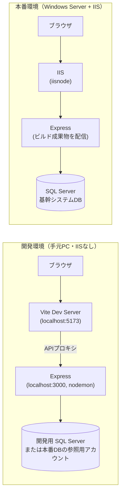

# 技術仕様書（architecture.md）

## 前提

- 本ドキュメントは `product-requirements.md`・`functional-design.md` で決定した内容を踏まえ、技術的な実現方法を定義するものである。
- 開発機（手元PC）には **IIS がインストールされていない**。ローカル開発は IIS に依存せず、Node.js を直接起動する構成で完結させる。IIS は本番（Windows Server）にのみ存在する前提で設計する。

## テクノロジースタック

### バックエンド

- **ランタイム**: Node.js（LTS版）
- **フレームワーク**: Express
- **言語**: TypeScript（保守性・型安全性のため採用。バックエンド・フロントエンド共通）
- **DB接続**: `mssql`（node-mssql）パッケージで SQL Server に直接接続し、既存テーブル・ビューに対して SELECT を実行する
- **認証／セッション**: `express-session` によるセッション管理、パスワードは `bcrypt` でハッシュ化して保存
  - セッションストアは既定の `MemoryStore` を使用せず、SQL Server 上に用意するセッション専用テーブルに保存する（`connect-mssql-v2` 等のストアアダプタを使用）。理由は後述の「技術的制約と要件」を参照。
  - セッションテーブルはアプリ用ユーザーテーブルと同様、本アプリ専用のテーブルとして作成する（基幹システムの既存テーブルとは分離）

### フロントエンド

- **フレームワーク**: React + Vite
- **スタイリング**: Tailwind CSS（CLAUDE.md の方針に準拠）
- **グラフ描画**: Recharts
  - React コンポーネントとして宣言的にグラフを組めるため、React + TypeScript の構成と親和性が高い
  - 担当者別売上推移・県別売上推移・担当者別売上対比は `LineChart` / `BarChart`、担当者別予算進捗（達成率表示）は `RadialBarChart` を使用する想定
- **構成**: SPA としてビルドし、Express が静的ファイル（ビルド成果物）を配信する。API 通信は `/api/*` に対して行う

### インフラ・稼働環境

- **本番稼働環境**: Windows Server 上の IIS
- **IIS ⇔ Node.js 連携方式**: `iisnode`
  - ARR（Application Request Routing）によるリバースプロキシ方式は不採用とする（Node.js アプリのプロセス管理を別途用意する必要があり、構成が複雑になるため）
  - `iisnode` は IIS が Node.js プロセスを直接管理する方式で、導入がシンプルな反面、OSS自体の更新が長期間止まっているため、採用する Node.js のバージョンとの組み合わせで事前に動作確認を行う
  - IIS のワーカープロセスリサイクルにより Node.js プロセスが再起動されることがあるため、下記「セッション管理」の対応（永続化されたセッションストアの使用）を必須とする
- **データベース**: 既存の社内基幹システム SQL Server（本アプリ専用のユーザー認証テーブルも同一 SQL Server 内、または別スキーマに配置）

## 開発ツールと手法

### ローカル開発環境（IIS 非依存）

開発機には IIS が存在しないため、以下の方針で開発を行う。

- バックエンド（Express）は `nodemon` 等を用いてローカルで直接起動する（例: `npm run dev` → `http://localhost:3000`）
- フロントエンド（Vite）は Vite の開発サーバーで起動し、API リクエストは Vite のプロキシ機能で Express（`http://localhost:3000`）へ転送する
- IIS 固有の機能（`web.config` によるリライトルール、`iisnode` の設定など）はローカルでは動作確認できないため、**IIS に依存するロジックをアプリケーションコード側に持ち込まない**（IIS はあくまで「入り口」として扱い、認証・ルーティング・セッション等のアプリケーションロジックは Node.js 側で完結させる）
- `web.config`（IIS 用設定ファイル）は本番デプロイ時にのみ使用するファイルとして管理し、ローカル開発の動作には影響しないことを確認する

- **パッケージ管理**: npm
- **Lint / フォーマット**: ESLint + Prettier
- **バージョン管理**: Git
  - リポジトリ: [https://github.com/naoya1109-t/EigyoCare.git](https://github.com/naoya1109-t/EigyoCare.git)
- **環境変数管理**: `.env`（`dotenv`）で DB 接続情報・セッションシークレット等を管理し、開発／本番で値を切り替える（`.env` はリポジトリに含めない）

## 技術的制約と要件

- **開発機に IIS がないことへの配慮**
  - ローカル開発・動作確認は Node.js 単体（Express + Vite）で完結させ、IIS の有無に依存しない
  - IIS 関連の設定（`web.config`、`iisnode.yml` 等）は本番デプロイ作業の一部として扱い、実機（本番 Windows Server）または IIS がインストールされた検証機での確認が別途必要になることを前提とする
  - 本番同等の動作確認（IIS 経由でのアクセス、リバースプロキシの挙動）は、開発機では行えないため、デプロイ後の本番環境での確認手順を別途用意する
- **セッション管理**
  - `iisnode` はワーカープロセスが再起動（リサイクル）されることがあり、既定の `MemoryStore` ではセッションが失われる可能性がある。SQL Server 上のセッション専用テーブルに保存する方式を必須とする
- **SQL Server 接続**
  - 基幹システムの既存テーブル・ビューに対して直接 SELECT する構成のため、接続アカウントの権限は参照専用（第2目標の見積価格更新機能を除く）に限定する
  - セッション専用テーブルへは書き込み（INSERT/UPDATE/DELETE）が必要なため、基幹データ参照用の接続アカウントとは別に、セッションテーブルのみ書き込み権限を持つ接続アカウントを用意する
  - 接続文字列は環境変数で管理し、開発用DBと本番DBを切り替え可能にする
  - 仕入先データは別DB（`10.194.5.55` / `Medical` / `dbo.T430仕入先`）に存在するが、`SaleDB` からリンクサーバー経由のビュー（`dbo.SV0020仕入先`）で透過的に参照できるため、アプリ側で別途接続設定を行う必要はない（`functional-design.md` 参照）
- **セキュリティ**
  - 全画面でログイン認証必須（未認証時は 401 を返し、フロントエンドでログイン画面へリダイレクト）
  - パスワードは平文で保存しない（`bcrypt` によるハッシュ化）
  - SQL インジェクション対策として、`mssql` パッケージのパラメータ化クエリを使用する
- **レスポンシブ対応**
  - Tailwind CSS のブレークポイントを用いて PC・スマートフォン双方に対応する（詳細は `development-guidelines.md` で定義）

## パフォーマンス要件

- **想定同時アクセス数**: 小規模営業チーム（数名〜十数名程度）を想定した規模であり、大規模な負荷対策は不要
- **レスポンスタイム**: 一覧・詳細画面は3秒以内、グラフ・集計画面は5秒以内を目安とする
- **可用性**: 24時間365日の稼働保証は不要。平日の業務時間帯（例: 9:00〜18:00）に安定して利用できることを目標とし、メンテナンスは業務時間外に実施する
