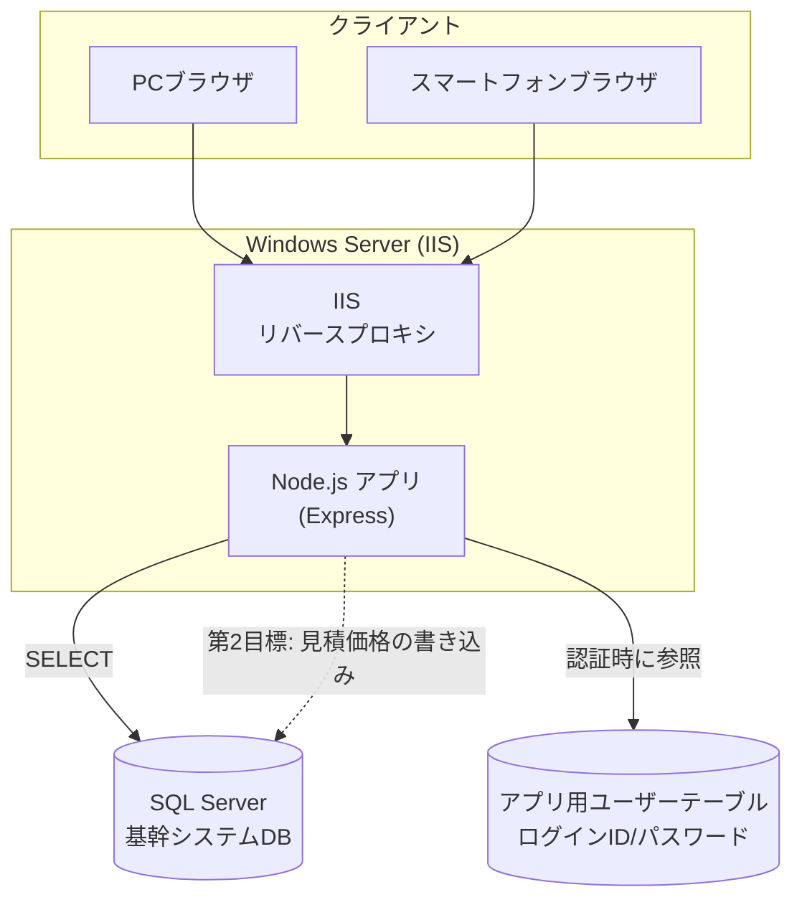
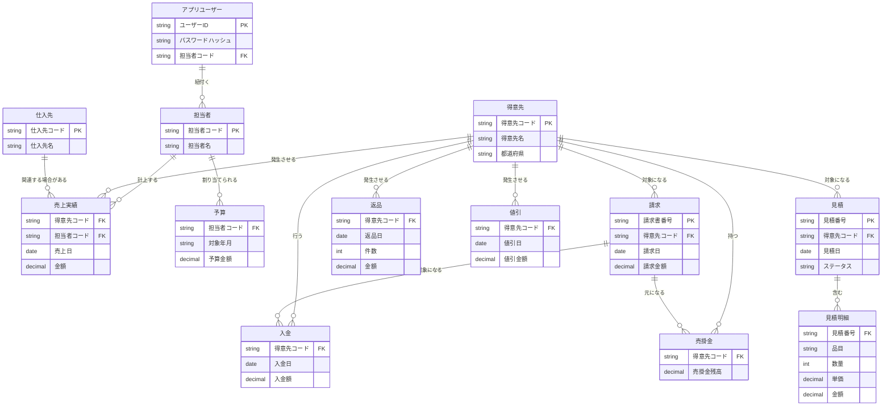
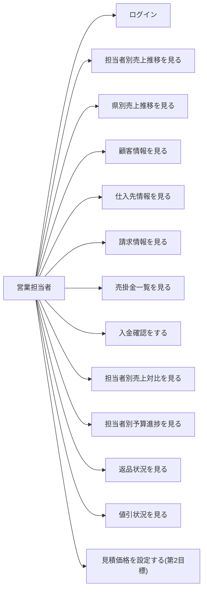
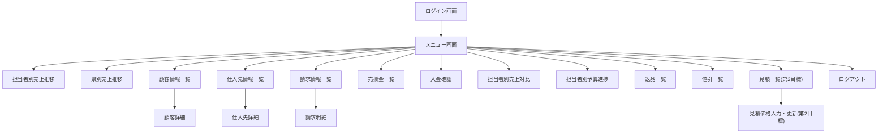

# 機能設計書（functional-design.md）

## 前提

- バックエンド: Node.js (Express 等)
- データアクセス: 基幹システム（SQL Server）の既存テーブル・ビューに対して直接 SELECT する
- 認証: 本アプリ独自のユーザー ID／パスワード管理
- 最終稼働環境: Windows Server 上の IIS（`architecture.md` にて詳細化）

> **[要確認]** 本ドキュメントに登場するテーブル名・カラム名は、実際の基幹システムの DB スキーマが未確認のため仮称。実装前に DB 調査・突合が必要。

## システム構成図



- IIS は `iisnode` により Node.js アプリへ処理を引き渡す（ARR によるリバースプロキシ方式は不採用。詳細は `architecture.md` を参照）。
- アプリ用ユーザーテーブル（ログイン ID／パスワード）は SQL Server 内に本アプリ専用のテーブルとして持つか、別スキーマで管理するかは **[要確認]**。

## 機能ごとのアーキテクチャ

全メニュー共通で、以下の流れを取る。

```
ブラウザ → (認証チェック) → Express ルーティング → データ取得モジュール → SQL Server → 画面描画
```

- 認証が必要な画面は共通のログインチェック処理（ミドルウェア）を通過する
- 各メニューは「一覧・集計を取得する API」＋「それを表示する画面」の組で構成される
- グラフ表示を伴うメニュー（担当者別売上推移、県別売上推移、担当者別予算進捗）は、共通のグラフコンポーネントを使い回す

### メニュー別の分類

| # | メニュー | 種別 | 主なデータ軸 |
|---|---|---|---|
| 1 | ログイン認証 | 共通機能 | ユーザーID/パスワード |
| 2 | 担当者別売上推移 | 集計・グラフ | 担当者 × 月 |
| 3 | 県別売上推移 | 集計・グラフ | 都道府県 × 月 |
| 4 | 顧客情報 | マスタ参照 | 得意先 |
| 5 | 仕入先情報 | マスタ参照 | 仕入先 |
| 6 | 請求情報 | 明細参照 | 得意先 × 請求書 |
| 7 | 売掛金一覧 | 集計参照 | 得意先 |
| 8 | 入金確認 | 明細参照 | 得意先 × 入金 |
| 9 | 担当者別売上対比 | 集計・グラフ | 担当者 × 期間（月初〜前日） |
| 10 | 担当者別予算進捗 | 集計・グラフ | 担当者 × 予算 |
| 11 | 返品 | 集計・明細参照 | 返品 |
| 12 | 値引 | 集計・明細参照 | 値引 |
| 13 | 見積価格設定（第2目標） | 参照＋更新 | 見積 × 見積明細 |

> **[要確認]** 各メニューの絞り込み条件（期間指定、担当者選択、得意先検索など）や表示項目（カラム）の詳細は未確定。実装前に画面ごとに確認する。

## データモデル定義（ER図）

現時点で想定される論理エンティティを仮に整理する（テーブル名・カラム名は仮称、実スキーマ調査後に確定）。



> **[要確認]**
> - 上記エンティティ・カラムは想定にすぎず、実際の基幹システムの物理テーブル／ビュー構成に合わせて修正が必要
> - 「都道府県」は得意先マスタの住所情報から取得するのか、別項目で管理されているのか要確認
> - 見積の「価格（金額）」について、営業が入力・更新する対象が見積明細の単価／金額なのか、見積全体の合計額なのか要確認
> - アプリ用ユーザーと基幹システムの担当者マスタの紐付け方法（1対1か、複数ユーザーが同一担当者に紐づくか）は要確認

## コンポーネント設計

### 共通コンポーネント

- **ログイン画面** - ユーザーID／パスワード入力、認証処理
- **ヘッダー／グローバルナビゲーション** - ログインユーザー名表示、ログアウト、メニュー一覧（レスポンシブ対応、スマートフォンではハンバーガーメニュー化）
- **一覧テーブルコンポーネント** - 顧客情報、仕入先情報、請求情報、売掛金一覧、入金確認、返品、値引などの表形式表示で共通利用
- **グラフコンポーネント** - 担当者別売上推移、県別売上推移、担当者別売上対比、担当者別予算進捗で共通利用（月次推移の折れ線・棒グラフ、予算進捗はゲージ／達成率表示）
- **検索・絞り込みフォーム** - 期間指定、担当者選択、得意先検索など各画面で共通利用

### 画面別コンポーネント

| 画面 | 主なコンポーネント |
|---|---|
| 担当者別売上推移 | 担当者選択、月次推移グラフ |
| 県別売上推移 | 都道府県選択、月次推移グラフ |
| 顧客情報 | 得意先検索、顧客情報一覧・詳細 |
| 仕入先情報 | 仕入先検索、仕入先情報一覧・詳細 |
| 請求情報 | 得意先選択、請求書一覧・明細 |
| 売掛金一覧 | 得意先別売掛金一覧 |
| 入金確認 | 得意先選択、入金状況一覧 |
| 担当者別売上対比 | 担当者選択、対比グラフ・表 |
| 担当者別予算進捗 | 担当者選択、進捗表示（グラフ／ゲージ） |
| 返品 | 期間・得意先絞り込み、件数・金額一覧 |
| 値引 | 期間・得意先絞り込み、金額一覧 |
| 見積価格設定（第2目標） | 見積検索・一覧、見積明細の価格入力・更新フォーム |

## ユースケース図



## 画面遷移図



## ワイヤフレーム

> **[要確認]** 各画面の詳細なレイアウトは未作成。基本方針として、PCではサイドメニュー＋メインコンテンツ、スマートフォンではハンバーガーメニュー＋縦積みレイアウトのレスポンシブ構成とする（`development-guidelines.md` にて Tailwind CSS のブレークポイント方針を定める）。

## API設計

Express によるバックエンドAPI（REST, JSON）を想定。すべて認証済みセッションが前提（未認証時は 401 を返しログイン画面へリダイレクト）。

| メソッド | パス | 概要 |
|---|---|---|
| POST | `/api/login` | ログイン認証 |
| POST | `/api/logout` | ログアウト |
| GET | `/api/sales/by-rep` | 担当者別売上推移取得 |
| GET | `/api/sales/by-prefecture` | 県別売上推移取得 |
| GET | `/api/customers` | 顧客情報一覧取得 |
| GET | `/api/customers/:code` | 顧客情報詳細取得 |
| GET | `/api/suppliers` | 仕入先情報一覧取得 |
| GET | `/api/suppliers/:code` | 仕入先情報詳細取得 |
| GET | `/api/invoices` | 請求情報一覧取得 |
| GET | `/api/invoices/:no` | 請求明細取得 |
| GET | `/api/receivables` | 売掛金一覧取得 |
| GET | `/api/payments` | 入金確認一覧取得 |
| GET | `/api/sales/comparison` | 担当者別売上対比取得（月初〜前日） |
| GET | `/api/budget/progress` | 担当者別予算進捗取得 |
| GET | `/api/returns` | 返品情報取得 |
| GET | `/api/discounts` | 値引情報取得 |
| GET | `/api/quotes` | 見積一覧取得（第2目標） |
| GET | `/api/quotes/:no` | 見積明細取得（第2目標） |
| PUT | `/api/quotes/:no/price` | 見積価格の入力・更新（第2目標） |

> **[要確認]** 各エンドポイントのリクエストパラメータ（絞り込み条件）、レスポンス項目の詳細は画面設計確定後に定義する。
