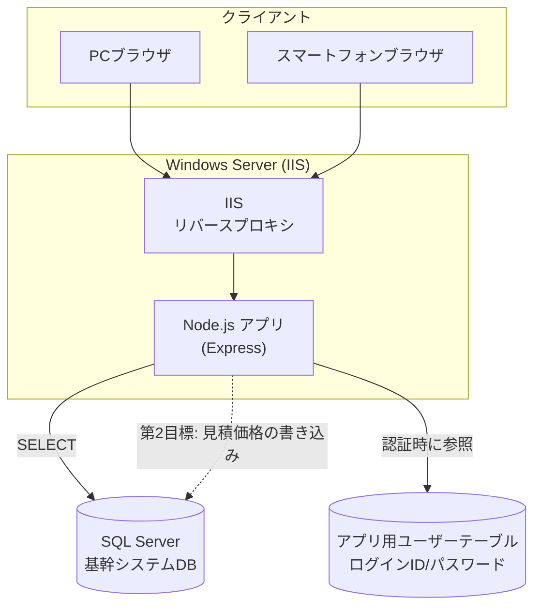
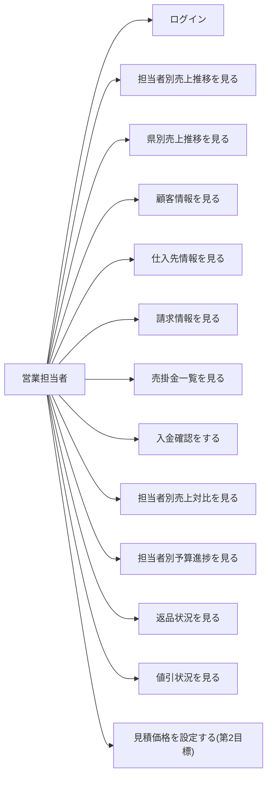
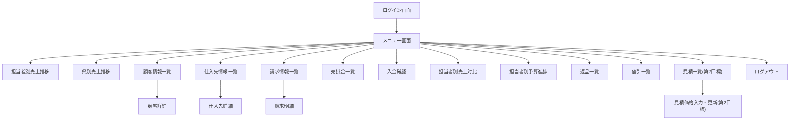

# 機能設計書（functional-design.md）

## 前提

- バックエンド: Node.js (Express 等)
- データアクセス: 基幹システム（SQL Server）の既存テーブル・ビューに対して直接 SELECT する
- 認証: 本アプリ独自のユーザー ID／パスワード管理
- 最終稼働環境: Windows Server 上の IIS（`architecture.md` にて詳細化）

> **[要確認]** 本ドキュメントに登場するテーブル名・カラム名は、実際の基幹システムの DB スキーマが未確認のため仮称。実装前に DB 調査・突合が必要。

## システム構成図



- IIS は `iisnode` により Node.js アプリへ処理を引き渡す（ARR によるリバースプロキシ方式は不採用。詳細は `architecture.md` を参照）。
- アプリ用ユーザーテーブル（ログイン ID／パスワード）は SQL Server 内に本アプリ専用のテーブルとして持つか、別スキーマで管理するかは **[要確認]**。

## 機能ごとのアーキテクチャ

全メニュー共通で、以下の流れを取る。

```
ブラウザ → (認証チェック) → Express ルーティング → データ取得モジュール → SQL Server → 画面描画
```

- 認証が必要な画面は共通のログインチェック処理（ミドルウェア）を通過する
- 各メニューは「一覧・集計を取得する API」＋「それを表示する画面」の組で構成される
- グラフ表示を伴うメニュー（担当者別売上推移、県別売上推移、担当者別予算進捗）は、共通のグラフコンポーネントを使い回す

### メニュー別の分類

| # | メニュー | 種別 | 主なデータ軸 |
|---|---|---|---|
| 1 | ログイン認証 | 共通機能 | ユーザーID/パスワード |
| 2 | 担当者別売上推移 | 集計・グラフ | 担当者 × 月 |
| 3 | 県別売上推移 | 集計・グラフ | 都道府県 × 月 |
| 4 | 顧客情報 | マスタ参照 | 得意先 |
| 5 | 仕入先情報 | マスタ参照 | 仕入先 |
| 6 | 請求情報 | 明細参照 | 得意先 × 請求書 |
| 7 | 売掛金一覧 | 集計参照 | 得意先 |
| 8 | 入金確認 | 明細参照 | 得意先 × 入金 |
| 9 | 担当者別売上対比 | 集計・グラフ | 担当者 × 期間（月初〜前日） |
| 10 | 担当者別予算進捗 | 集計・グラフ | 担当者 × 予算 |
| 11 | 返品 | 集計・明細参照 | 返品 |
| 12 | 値引 | 集計・明細参照 | 値引 |
| 13 | 見積価格設定（第2目標） | 参照＋更新 | 見積 × 見積明細 |

> **[要確認]** 各メニューの絞り込み条件（期間指定、担当者選択、得意先検索など）や表示項目（カラム）の詳細は未確定。実装前に画面ごとに確認する。

## データモデル定義（実テーブル対応表）

`10.194.5.57` / `SaleDB` の実スキーマを調査した結果を反映する（調査日: 2026-07-10）。テーブル名はレガシーの命名規則（`ET`=基幹取引テーブル、`ST`=在庫系、`SV`/`EV`=ビュー）をそのまま使用している。

### 物理テーブル・ビュー対応表

| # | メニュー／論理エンティティ | 物理テーブル・ビュー | 主なカラム | 備考 |
|---|---|---|---|---|
| - | 担当者 | `dbo.ET0010担当者` | 担当者CD(PK,smallint), 担当者名, ログインID, PASSWORD | ログインID/PASSWORDが平文で保存された既存資産。**`app.AppUser`の初期投入は、このテーブルのログインID・PASSWORD（平文）をそのまま流用し、パスワードのみbcryptでハッシュ化して登録した**（2026-07-13実施、全49件中32件にログインIDあり、32件とも登録・既存パスワードとの一致を検証済み）。ログインIDが無い担当者（17件）はアプリにログインできない状態のままなので、必要に応じて追加のアカウント発行が必要。なお、似た構造の`dbo.ET0025担当者保存`（別テーブル、44件中17件にログインIDあり）は当初こちらを移行元と誤認して投入してしまったが、正しい移行元は`ET0010担当者`と判明したため、`ET0025担当者保存`由来のデータは全削除して`ET0010担当者`で再投入し直した |
| 2,3,9 | 売上実績（担当者別・月次） | `dbo.ET0100担当者別売上` | 担当者CD+売上年月(PK), 売上金額, 割賦売上金額, 粗利金額, 割賦粗利金額 | 月次集計済み。アプリ側での再集計は不要 |
| 3 | 売上実績（県別・担当者別・月次） | `dbo.ET0140県別担当者別売上` | 県CD+担当者CD+売上年月(PK), 売上金額 等 | |
| 9 | 担当者別売上対比（当月） | `dbo.ET0150担当者別売上当月比較`（設計時点の想定） | 担当者CD(PK), 売上金額, 粗利合計 | **実装時に確認したところ、このテーブルは0件（空）だった。** 代わりに`ET0100担当者別売上`の最新月（`MAX(売上年月)`）の行を担当者別売上対比として使用している（`server/src/routes/sales.ts`の`/api/sales/comparison`参照）。`ET0150`が本来どういうタイミングで使われるテーブルなのかは未確認 |
| 4 | 顧客情報（得意先） | `dbo.ET0020得意先` | 得意先CD(PK,int), 得意先名, 郵便番号, 県CD(→`ET0001県`), 住所1/2, TEL, FAX, 営業担当CD, 締日 等（全43列） | `検索対象外`列（tinyint）は値が`1`（2291件）と`2`（7333件）のみで、`1`が検索対象外を意味する。顧客情報一覧（`GET /api/customers`）は`検索対象外 = 2`のみを抽出する（指示により2026-07-13追加）。顧客詳細（`GET /api/customers/:code`）にはこの絞り込みは適用していない。`締日`列は`5,10,15,20,25,31`のみの値で、`31`が全体の約89%（8557件）を占める。`31`は「末日（月末）」を意味する慣用表現と判断し、画面では`31`→「末日締め」、それ以外→「N日締め」と表示する |
| - | 県マスタ | `dbo.ET0001県` | 県CD(PK), 県名 | 得意先.県CDのFK先。都道府県はこちらから取得する |
| 5 | 仕入先情報 | `[10.194.5.55].Medical.dbo.T430仕入先`（リンクサーバー4部名で直接クエリ） | 仕入先CD, 仕入先名, 郵便番号, 県CD, 住所1/2, TEL, FAX, 担当者情報 等（全106列） | **仕入先データは別DB（`10.194.5.55` / `Medical` / `dbo.T430仕入先`）にあり**、SaleDB側の`dbo.SV0020仕入先`ビュー（`SELECT * FROM [10.194.5.55].Medical.dbo.T430仕入先`）経由でも参照できるが、**このビューはメタデータが古く（キャッシュされた列数が86列、実際のリンク先テーブルは106列）、列名と実データがズレて返ってくる不具合を確認した**（例: `担当者役職`列にカナ氏名、`Email`列に電話番号が入る）。既存アプリはこのビューをほぼ使わず、カナ検索ストアド`ES0190仕入先リスト`（`@カナ`一文字→LIKE検索、取得列は仕入先CD/仕入先名のみ）を使っているため、このズレは気づかれていなかったと思われる。**本アプリでは`SV0020仕入先`ビューを使わず、リンクサーバーの実テーブルを直接クエリすることでこの不具合を回避している**（`server/src/routes/suppliers.ts`参照）。ビュー自体の修正（`sp_refreshview`等）は本アプリの範囲外のためDBA/システム担当者に別途申し送りが必要 |
| 6 | 請求情報（ヘッダ） | `dbo.ET0110請求` | 請求番号(PK), 請求日, 得意先CD, 前回請求残高, 売上額, 消費税額, 入金額, 今回請求残高 等 | |
| 6 | 請求情報（明細） | `dbo.ET0120請求明細` / `dbo.EV0100請求明細`（VIEW） | 請求明細番号(PK), 請求番号, 売上日, 種別区分, 区分, 商品名, 受注数量, 販売単価, 販売金額, 行備考 | 行の種別は`種別区分`/`区分`で判別する（下記参照） |
| 7 | 売掛金一覧 | `dbo.ET0130売掛` | 得意先CD+年月(PK), 売上額, 入金額, 今回売掛残高 等 | |
| 4 | 顧客詳細の売掛推移（直近12ヶ月） | `app.ReceivablesByCustomer`（VIEW、本アプリで新規作成） | 得意先CD, 年月, 売上額, 入金額, 今回売掛残高 | `ET0130売掛`を直接クエリせず、ビュー経由でアクセスする方針により新規作成。類似の既存ストアド`ES0120売掛推移`は担当者×会計年度で得意先を横に並べる別用途で、入金額を含まないため流用できなかった。**`ET0130売掛`は売上または入金が発生した月にしかレコードが作らないため、取引頻度の低い得意先では「直近12件」が数年前まで遡ってしまうことが判明**（例: 得意先CD:30は全99件中直近12件が2023年9月〜2026年9月に及んでいた）。フィードバックにより、暦月固定の直近12ヶ月ウィンドウに変更し、取引のない月は0円で埋める仕様にした（`server/src/routes/customers.ts`参照）。**さらに、`今回売掛残高`は列名に反して累積残高ではなく「その月単独の売上額-入金額」であることをデータで確認した**（例: 202509月は売上225022-入金55242=169780で今回売掛残高と一致）。画面に表示する「売掛残」は、得意先の最初のレコードから対象月まで`今回売掛残高`を累積加算して算出している |
| 8 | 入金確認 | `dbo.ET0160入金確認` | 得意先CD(PK), 前々々回〜今回の入金額/売上額/請求額（20列） | 直近複数回分の入金・売上・請求の推移比較が1行に集約されている。「入金確認」画面のデータ源として最も適する |
| - | 入金（取引単位） | `dbo.ET0150入金` | 得意先CD+入金日(PK), 入金額 | 個別入金の明細が必要な場合はこちら |
| 10 | 担当者別予算進捗 | `dbo.ET0170営業担当予算` | 期+営業担当CD(PK), `10月`〜`9月`の列（月別に列が分かれるピボット形式） | 会計年度は10月始まり。取得後、月ごとの列をアプリ側でUNPIVOTして扱う |
| - | 期（会計年度）マスタ | `dbo.ET0005期` | 期(PK), 開始年月, 現在 | 予算テーブルのPKの一部。「現在」列で当期を判定できる |
| 11 | 返品 | `dbo.ET0120請求明細` のうち `区分='4'` の行（推測） | 受注数量・販売金額が負値。商品名に「取引日◯◯/◯◯ RT...」の接頭辞が付く | 返品専用のテーブルは存在しない。サンプルデータからの推測であり、**要確認**（下記コード値の節を参照） |
| 12 | 値引 | `dbo.ET0120請求明細` のうち `区分='6'` または `'7'` の行（推測） | 販売単価・販売金額が負値。商品名／行備考に「値引き」の文言 | 値引専用のテーブルは存在しない。同上、**要確認** |
| 13（第2目標） | 見積 | 該当テーブルなし | - | 基幹システムには見積機能自体が存在しない模様。第2目標の実装時に新規テーブル設計が必要 |

### `ET0120請求明細` のコード値について（要確認）

`種別区分` と `区分` はコード値だが、コードの意味を定義したマスタテーブルは基幹システム内に存在しなかった（拡張プロパティ・コードマスタとも未検出）。以下はサンプルデータ（実データ）を目視確認して推測した内容であり、**業務担当者への確認が必須**。

| 種別区分 | 意味（推測） |
|---|---|
| 1 | 通常売上明細 |
| 2 | 消費税集計用の注記行（金額の内訳表示。商品行ではない） |
| 5 | 分割払い（割賦）売上 |
| 9 | 入金取引（「御入金(振込)」「御入金(手数料)」等） |

| 区分（種別区分=1 or 2 の場合の内訳） | 意味（推測） |
|---|---|
| 1, 2, 5 | 通常の商品販売行 |
| 4 | **返品**（数量・金額が負値、商品名に「RT」を含む） |
| 6 | **値引き**（単価・金額が負値、商品名／備考に「値引き」を含む） |
| 7 | **値引き**（送料・システム利用料等の減算調整。種別区分=2側に出現） |
| 9 | 消費税集計行（種別区分=2に付随） |

> このコード値の解釈を誤ると、返品・値引画面に誤ったデータが表示される。実装前に営業事務またはシステム担当者に正式な区分定義を確認すること。

### データ品質に関する注意（フェーズ6〜7実装時に発見）

- **`ET0100担当者別売上`・`ET0130売掛`等に将来月の断片データが混入している**: 正常な月は全担当者／全得意先分のデータが揃う（例: 担当者別売上なら約45〜47件）が、まだ到来していない将来の年月に対しても1〜数件だけの断片的な行が存在する（バッチ処理の先行登録やテストデータの可能性）。単純に`MAX(売上年月)`や`MAX(年月)`を取ると、この断片データを「最新月」と誤認識してしまう。本アプリでは「一定件数以上（目安50件・100件）ある年月のみを対象にMAXを取る」という防御的な実装で回避している（`sales.ts`の`/api/sales/comparison`、`receivables.ts`、`budget.ts`参照）。DBスキーマ調査時点でこの断片データの発生原因は未確認であり、原因次第では閾値の調整が必要になる場合がある
- **`ET0120請求明細`のカラムに`AS lineNo`という別名を付けるとSQL構文エラーになる**: `lineNo`（大文字小文字を問わず）がこのSQL Serverでは予約語的に扱われており、`SELECT ... AS lineNo`のような自由な別名指定で構文エラーが発生する（原因未特定。古いSQL Server互換レベルの影響の可能性）。本アプリでは`lineNumber`という別名を使うことで回避している。他のカラムについても、動作しない別名に遭遇した場合はまずこの可能性を疑うこと
- **`WHERE 列 = @param OR (@param IS NULL AND ...)`という条件は、初回実行後にクエリがタイムアウトするまで固まることがある**: `/api/sales/by-prefecture`で「月未指定時は最新月」を1つのSQLで表現しようとしたところ、初回は成功するが2回目以降の実行でSQL Server側が15秒でタイムアウトする現象が発生した（いわゆるパラメータスニッフィングによる不良な実行プランがキャッシュされたと推測される。原因の確定はできていない）。対策として、月が未指定の場合はアプリ側で先に対象月を1回のクエリで確定させ、その後は`月 = @month`という単純な等価条件のみのクエリを実行する形に分離した。同様の`OR IS NULL`パターンを他のエンドポイントで使う場合は注意すること

### 県別売上推移の表示方針（フェーズ8後にフィードバックにより変更）

当初は都道府県をプルダウンで1つ選び、月次推移を折れ線グラフで表示する仕様だったが、以下の理由で「対象月（選択可能）における全都道府県の横棒グラフ比較」に変更した。

- 都道府県ごとに1つずつ選んで見るより、直近の状況を一覧で比較したいという要望
- 月初は当月分の実績がまだ少ないため、「直近の実績が揃っている月」をデフォルトにしつつ、過去の月も選べるようにした（`/api/sales/prefecture-months`で選択肢を取得）
- 横棒グラフの縦軸（都道府県名）はRechartsの既定では自動的にラベルが間引かれることがあるため、`interval={0}`で全件表示に固定
- 「並び順」セレクトで売上金額順／県CD順を切り替え可能（クライアント側でソート）

同じ理由・同じパターンで「担当者別売上推移」も、担当者選択＋月次推移の折れ線グラフから、対象月（選択可能）における全担当者の横棒グラフ比較に変更した（`/api/sales/rep-months`で選択肢を取得、並び順は売上金額順／担当者CD順）。

> **[要確認]** 「実績が揃っている月」の判定に使っている行数のしきい値（担当者別売上・県別売上ともに、正常月の行数より十分小さい値）は、DBスキーマ調査時点のデータ件数から暫定的に決めたもの。基幹システム側の担当者数・都道府県別担当者数が変動した場合は、しきい値の見直しが必要になる可能性がある

### 論理ER図（参考）

```mermaid
erDiagram
    アプリユーザー ||--o{ 担当者 : "紐付く"
    担当者 ||--o{ 売上実績 : "計上する"
    担当者 ||--o{ 予算 : "割り当てられる"
    得意先 ||--o{ 売上実績 : "発生させる"
    得意先 ||--o{ 請求 : "対象になる"
    得意先 ||--o{ 入金 : "行う"
    得意先 ||--o{ 売掛金 : "持つ"
    請求 ||--o{ 請求明細 : "含む"
    請求明細 ||--o{ 返品 : "区分=4の行"
    請求明細 ||--o{ 値引 : "区分=6,7の行"

    アプリユーザー {
        string ユーザーID PK
        string パスワードハッシュ
        string 担当者コード FK
    }
    担当者 {
        smallint 担当者CD PK
        string 担当者名
    }
    得意先 {
        int 得意先CD PK
        string 得意先名
        tinyint 県CD FK
    }
    売上実績 {
        smallint 担当者CD FK
        datetime 売上年月
        money 売上金額
    }
    予算 {
        smallint 営業担当CD FK
        smallint 期 FK
        money "10月〜9月(列)"
    }
    請求 {
        int 請求番号 PK
        int 得意先CD FK
        datetime 請求日
        money 今回請求残高
    }
    請求明細 {
        int 請求明細番号 PK
        int 請求番号 FK
        varchar 種別区分
        varchar 区分
        money 販売金額
    }
    入金 {
        int 得意先CD FK
        datetime 入金日
        money 入金額
    }
    売掛金 {
        int 得意先CD FK
        char 年月
        money 今回売掛残高
    }
```

> 仕入先（`SV0020仕入先`）は別DBのため、上記ER図には含めていない。得意先・売上実績との直接的な外部キー関係はない（`glossary.md`のドメイン用語定義を参照）。

> **[要確認]**
> - 返品・値引の`区分`コードの意味（上記推測の正式な確認）
> - 見積（第2目標）は物理テーブルが存在しないため、新規設計が必要
> - アプリ用ユーザーと`ET0010担当者`の紐付け方法（1対1か、複数ユーザーが同一担当者に紐づくか）

## コンポーネント設計

### 共通コンポーネント

- **ログイン画面** - ユーザーID／パスワード入力、認証処理
- **ヘッダー／グローバルナビゲーション** - ログインユーザー名表示、ログアウト、メニュー一覧（レスポンシブ対応、スマートフォンではハンバーガーメニュー化）
- **一覧テーブルコンポーネント** - 顧客情報、仕入先情報、請求情報、売掛金一覧、入金確認、返品、値引などの表形式表示で共通利用
- **グラフコンポーネント** - 担当者別売上推移、県別売上推移、担当者別売上対比、担当者別予算進捗で共通利用（月次推移の折れ線・棒グラフ、予算進捗はゲージ／達成率表示）
- **検索・絞り込みフォーム** - 期間指定、担当者選択、得意先検索など各画面で共通利用

### 画面別コンポーネント

| 画面 | 主なコンポーネント |
|---|---|
| 担当者別売上推移 | 担当者選択、月次推移グラフ |
| 県別売上推移 | 都道府県選択、月次推移グラフ |
| 顧客情報 | 得意先検索、顧客情報一覧・詳細 |
| 仕入先情報 | 仕入先検索、仕入先情報一覧・詳細 |
| 請求情報 | 得意先選択、請求書一覧・明細 |
| 売掛金一覧 | 得意先別売掛金一覧 |
| 入金確認 | 得意先選択、入金状況一覧 |
| 担当者別売上対比 | 担当者選択、対比グラフ・表 |
| 担当者別予算進捗 | 担当者選択、進捗表示（グラフ／ゲージ） |
| 返品 | 期間・得意先絞り込み、件数・金額一覧 |
| 値引 | 期間・得意先絞り込み、金額一覧 |
| 見積価格設定（第2目標） | 見積検索・一覧、見積明細の価格入力・更新フォーム |

## ユースケース図



## 画面遷移図



## ワイヤフレーム

> **[要確認]** 各画面の詳細なレイアウトは未作成。基本方針として、PCではサイドメニュー＋メインコンテンツ、スマートフォンではハンバーガーメニュー＋縦積みレイアウトのレスポンシブ構成とする（`development-guidelines.md` にて Tailwind CSS のブレークポイント方針を定める）。

## API設計

Express によるバックエンドAPI（REST, JSON）を想定。すべて認証済みセッションが前提（未認証時は 401 を返しログイン画面へリダイレクト）。

| メソッド | パス | 概要 |
|---|---|---|
| POST | `/api/login` | ログイン認証 |
| POST | `/api/logout` | ログアウト |
| GET | `/api/sales/by-rep` | 担当者別売上推移取得 |
| GET | `/api/sales/by-prefecture` | 県別売上推移取得 |
| GET | `/api/customers` | 顧客情報一覧取得 |
| GET | `/api/customers/:code` | 顧客情報詳細取得 |
| GET | `/api/suppliers` | 仕入先情報一覧取得 |
| GET | `/api/suppliers/:code` | 仕入先情報詳細取得 |
| GET | `/api/invoices` | 請求情報一覧取得 |
| GET | `/api/invoices/:no` | 請求明細取得 |
| GET | `/api/receivables` | 売掛金一覧取得 |
| GET | `/api/payments` | 入金確認一覧取得 |
| GET | `/api/sales/comparison` | 担当者別売上対比取得（月初〜前日） |
| GET | `/api/budget/progress` | 担当者別予算進捗取得 |
| GET | `/api/returns` | 返品情報取得 |
| GET | `/api/discounts` | 値引情報取得 |
| GET | `/api/quotes` | 見積一覧取得（第2目標） |
| GET | `/api/quotes/:no` | 見積明細取得（第2目標） |
| PUT | `/api/quotes/:no/price` | 見積価格の入力・更新（第2目標） |
| GET | `/api/reps` | 担当者一覧取得（画面の担当者選択プルダウン用。実装時に追加） |
| GET | `/api/prefectures` | 都道府県一覧取得（画面の都道府県選択プルダウン用。実装時に追加） |

> **[要確認]** 各エンドポイントのリクエストパラメータ（絞り込み条件）、レスポンス項目の詳細は画面設計確定後に定義する。
>
> フェーズ6実装時点でのクエリパラメータ実績：
> - `/api/sales/by-rep?repCode=&months=` — `repCode`省略時は全社計を返す
> - `/api/sales/by-prefecture?prefectureCode=&months=` — 同上
> - `/api/budget/progress?repCode=&period=` — `period`省略時は`ET0005期`の`現在='1'`の期を使用。達成率は実績データが存在する月のみを対象に計算（未経過月は含まない）
